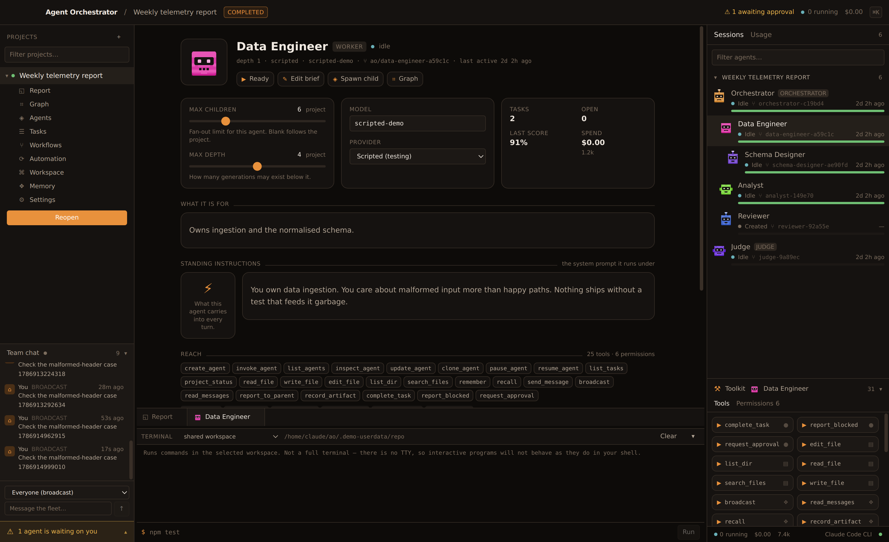

# Agent Orchestrator

Agent Orchestrator is a local-first desktop environment for building, running, judging, and
recursively coordinating fleets of AI agents. It gives each project a real execution loop: agents
work with tools and permissions, delegate tasks to one another, persist memory, and run on schedules
or workflows while a built-in Judge evaluates the outcomes against acceptance criteria.



This is not a single chat window with a few commands bolted on. It is a workspace for autonomous
software work where the system can plan, execute, review, revise, and escalate without hiding the
state in a black box. Everything remains local: SQLite on disk, no proprietary backend, and no
telemetry.

## Why teams use it

- Multi-agent orchestration with bounded recursion and permissions
- Real project execution that tracks tasks, tool calls, file changes, and verdicts
- Human approval gates for irreversible actions and risky tooling
- Workflow-driven automation for event-driven or scheduled work
- Workspace isolation with per-agent worktrees and reviewable diffs

See the full [screenshot gallery](./screenshots/README.md) for the main UI surfaces.

## Running it

```bash
npm install          # dependencies only; no compilation
npm run dev          # provisions Electron + better-sqlite3 binaries, then launches
npm test             # 75 tests: unit, integration, workflow, git and restart-recovery
npm run build        # typecheck + bundle main, preload and renderer
npm run dist:mac     # package a .dmg
```

The default provider is the **Claude Code CLI**, which uses your existing subscription. Install it
and make sure `claude` is on your `PATH` (or set `AO_CLAUDE_BIN` to its absolute path). An
Anthropic API provider is also included — add a key in Settings → Providers to enable it.

### About the native modules

Two binaries have to be in place before the app runs: Electron itself, and `better-sqlite3`, which
is a compiled addon that only loads under the ABI it was built for. The app runs on Electron's Node;
the test suite runs on yours.

`npm install` alone is not enough to arrange that. npm 11 and later block dependency install scripts
by default, so Electron's postinstall never downloads its binary; and on npm 10 the same install
would try to *compile* `better-sqlite3` against your local Node, which fails on Node 24+ because V8
removed APIs it uses.

So the project provisions both itself. `scripts/ensure-native.mjs`, wired to `predev` and `pretest`,
downloads the Electron binary and fetches the right `better-sqlite3` prebuild for whichever runtime
is about to load it, stamping what it did so repeat runs are instant. Nothing is compiled, and your
system Node version does not matter for running the app.

    npm run rebuild:electron   # force the Electron-ABI binary
    npm run rebuild:node       # force the Node-ABI binary

The one hard constraint is the test suite, which does run on your Node. `better-sqlite3` publishes
prebuilds for Node 20 to 23 only, so on anything newer `npm test` stops with instructions:

```bash
brew install node@22
PATH="$(brew --prefix node@22)/bin:$PATH" npm test
```

The application itself is unaffected — it never uses your system Node.

## The shape of it

```
Electron main                          Renderer
├── db/          SQLite + Drizzle      ├── views/     dashboard, agents, graph,
├── services/    projects, agents,     │              tasks, workflows, workspace,
│                tasks, tools, memory, │              automation, memory, settings
│                messages, schedules,  ├── store      live, event-driven
│                approvals, budgets,   └── api        one typed IPC channel
│                workflows, git,
│                workspace
├── runtime/     agent runtime, tool
│                gateway, providers,
│                MCP bridge
└── engines/     execution manager, scheduler,
                 judge, watchdog, workflow engine
```

The renderer has no Node access and no database handle. It calls named methods over a single
validated IPC channel and receives every state change as a pushed event, so nothing polls.

## How the loop actually works

```
mission → Orchestrator plans → creates agents → delegates tasks
                                     ↓
                             agents execute in parallel
                             (spawn children, invoke peers,
                              call tools, message each other)
                                     ↓
                                 Judge evaluates
                                ↙             ↘
                          REJECTED          APPROVED
                             ↓                  ↓
                     revision task        task complete
                             ↓                  ↓
                          re-judge      board empties → project reviewed
                                                        against its own criteria
                                                       ↙                    ↘
                                              gaps → new work           signed off
```

A task is never complete because an agent said so. The Judge reads what the agent *did* — its tool
calls, the files that exist on disk, the test output — scores it against the task's acceptance
criteria on a weighted rubric, and either approves it, sends back a revision with specific required
changes, or escalates to you. When the board empties, the project itself goes to the Judge against
its own acceptance criteria; unmet criteria become a new round of work for the Orchestrator rather
than a silent "done".

## Agents

An agent is a persistent row, not a chat session: a system prompt, a model, a toolkit, a permission
set, a place in the graph, and a task history. Anything you can do to an agent in the UI, an agent
can do to another agent through a tool — that symmetry is the point. `create_agent`, `invoke_agent`,
`delegate_task`, `create_task`, `create_schedule` and `create_tool` are ordinary tools subject to the
ordinary permission gate.

Recursion is bounded by budget and permission, not by architecture. There is no hard-coded
"developer → QA → deploy" pipeline; hierarchies emerge from what the Orchestrator decides the
mission needs. Depth, fan-out, fleet size, turns, tool calls, runtime and spend are all configurable
per project and default to conservative values.

Two rules make delegation safe:

- **An agent can only grant permissions it holds itself.** Requested permissions are intersected
  with the creator's.
- **Anything irreversible asks a human.** Dangerous tools, and any permission listed in the
  project's approval policy, block the execution until you answer in the Approvals dock.

## Workflows

A workflow is a graph you can run on demand, on an event, or from an agent's `run_workflow` tool.
The builder is a real node editor: drag nodes from the palette, connect them, configure each one,
and watch nodes light up as a run moves through them.

| Node | What it does |
| --- | --- |
| Agent | Runs an agent on a task through the normal executor and waits for the result |
| Task | Creates a task, optionally without waiting |
| Tool | Calls a tool using a chosen agent's permissions |
| Condition | Branches on a sandboxed expression over the run context |
| Judge | Evaluates a task and puts the verdict in the context |
| Parallel / Merge | Runs branches concurrently and rejoins |
| Loop | Repeats a body while a condition holds, up to a maximum |
| Human approval | Blocks until you answer, with separate approved and denied branches |
| Delay, Webhook, End | Wait, call an HTTP endpoint, finish |

Nodes are not a second implementation of anything: an Agent node goes through the same executor as a
delegated task, so limits, budgets, judging and events behave identically. `{{variable}}`
substitution and `saveAs` carry results between nodes. Graphs are validated before they can be saved
or run - a condition with no `false` branch is caught at design time, not halfway through a run - and
a step budget stops a graph that loops instead of finishing.

## Working on code: worktrees, editor and console

Turn on workspace isolation and each agent gets **its own git worktree on its own branch**. Several
agents can then edit the same repository at once without the last writer winning, and the diff you
review at the end is per-agent instead of an indistinguishable mess. The Workspace view shows every
worktree with its agent, and lets you diff, merge or discard each branch.

It also carries a file tree, a Monaco editor for reading and light edits, a per-file diff view of
what agents changed, and a console for running commands in the workspace. The console is a command
runner, not a pseudo-terminal - there is no TTY, so interactive programs will not behave as they do
in your shell. That is a deliberate trade: a PTY means another native module, and what you actually
need here is to run a build and watch it scroll.

## Providers

`ProviderAdapter` is the seam. Three implementations ship:

| Adapter | What it is |
| --- | --- |
| `claude-code` | Spawns the local Claude Code CLI. Orchestration tools reach it as an MCP server over a loopback control plane, so tool calls still flow through the permission gate. Agent permissions map onto the CLI's own tools — an agent without `FILES_WRITE` genuinely cannot write. |
| `anthropic-api` | Direct Messages API with its own tool loop. The reference implementation of the runtime contract. |
| `scripted` | Deterministic, in-process, for the test suite and dry runs. Only registered when explicitly enabled, so it can never quietly stand in for a real model. |

## Durability

Schedules live in SQLite, not in timers. On startup the scheduler works out which firings it missed
while the app was closed and applies each schedule's catch-up policy (`run_once`, `run_all` or
`skip`). Tasks caught mid-flight by a crash are requeued with an explanatory error rather than left
hanging. Executions orphaned by a hard quit are reaped by the watchdog.

## The watchdog

Every running execution is checked for silence, runaway runtime, repeated tool failures and budget
exhaustion. The smallest useful action is taken first — nudge the parent agent, then escalate to a
human, then terminate — rather than letting a stuck agent burn tokens quietly.

## Tests

```
tests/domain.test.ts        projects, recursion limits, dependencies, memory, permissions
tests/judge.test.ts         verdict parsing, weighted scoring, thresholds, panel aggregation
tests/orchestration.test.ts the full loop end to end, project sign-off, safety refusals
tests/scheduler.test.ts     cron/interval/event/dependency triggers, catch-up, restart recovery
tests/watchdog.test.ts      stuck detection, escalation, budget enforcement
tests/workflow.test.ts     graph validation, branching, parallelism, loops, approvals, triggers
tests/git.test.ts          status and diff, worktree isolation, concurrent agents, merging
```

Two of these are worth calling out. The workflow suite asserts that three 30ms parallel branches
finish in under 85ms, so "parallel" means concurrent rather than merely drawn side by side. The git
suite runs two agents that write the same file at the same time and then checks that each version
survives on its own branch and the shared checkout is untouched.

The end-to-end test drives the deterministic provider through the real runtime: the Orchestrator
staffs a fleet, a worker spawns a child of its own and invokes a peer, files land on disk, the Judge
rejects the first attempt, a revision runs, and the second attempt is approved — then asserts the
files, the graph edges, the nested execution records and the event timeline.

## Development scripts

```bash
npx vite-node scripts/seed-demo.ts -- .demo-userdata   # build a realistic database
xvfb-run -a node scripts/visual-check.mjs              # launch the app and screenshot every view
```

`scripts/visual-check.mjs` boots the real Electron app against a seeded database with Playwright and
captures each surface to `.shots/`, which is how the UI gets reviewed rather than assumed.

## Screenshots

Browse the complete UI gallery in [screenshots/README.md](./screenshots/README.md).

## Keyboard

| | |
| --- | --- |
| `⌘K` | Command palette — navigate, run tasks, pause agents, switch projects |
| `⌘N` | New project |
| `⌘J` | Toggle the activity dock |

## What is not here

Kept honest rather than stubbed:

- The console has no PTY, as described above.
- Workflow schedules are wired through the existing scheduler rather than a separate cron field on
  the workflow itself; use a schedule whose task runs the workflow, or an event trigger.
- Only the macOS packaging target is configured. `electron-builder` needs a `win`/`linux` block and
  icons before it will produce anything for those.
